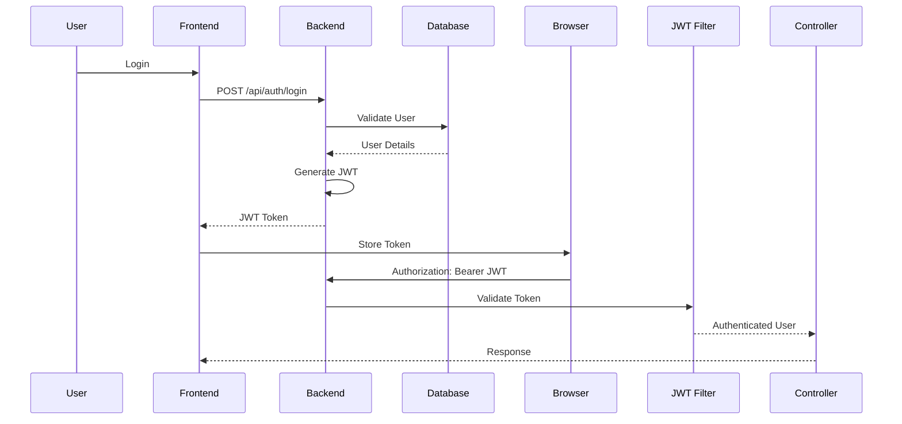
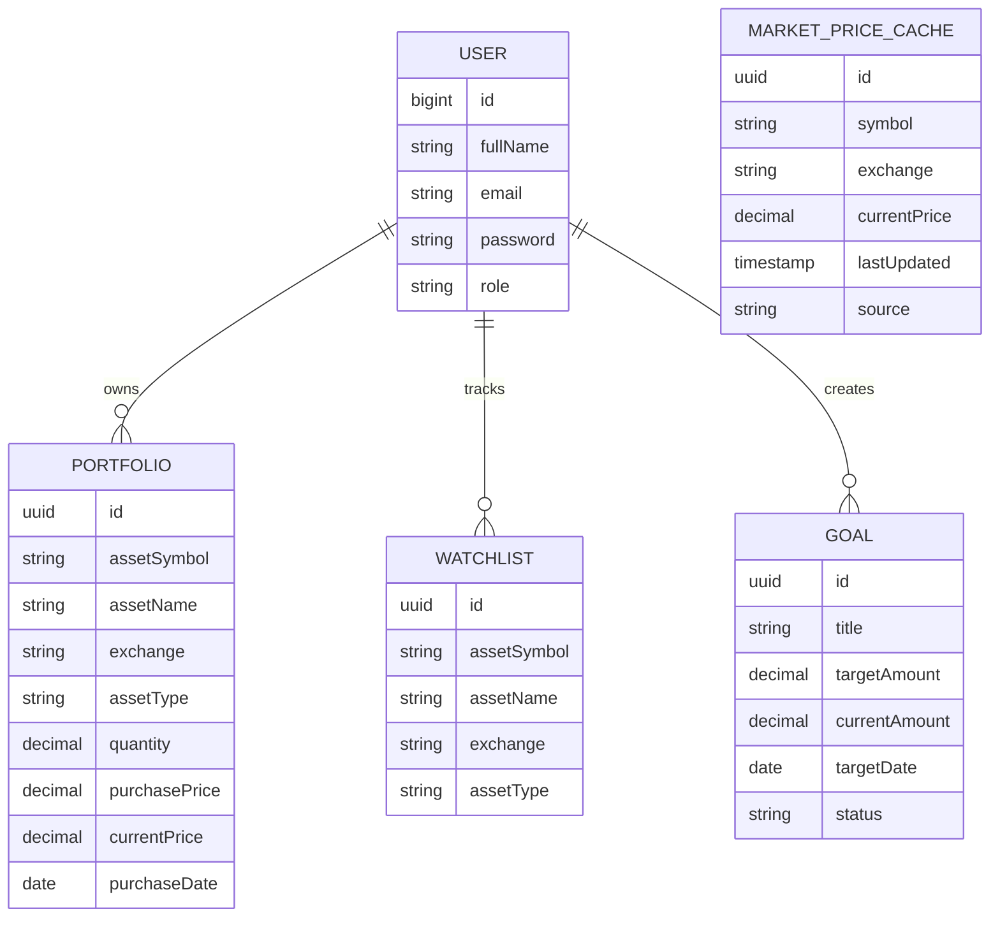
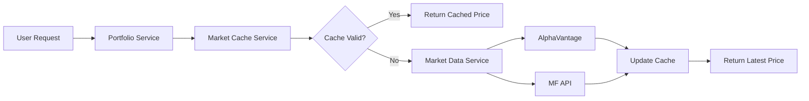
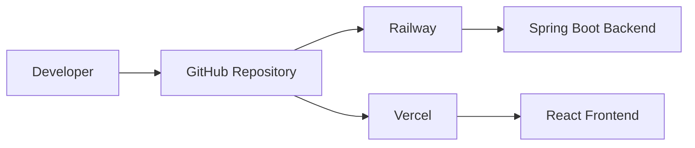

# FinPilot

### Smart Portfolio & Investment Tracker

A full-stack investment portfolio management platform that enables users to securely track **Stocks**, **ETFs**, and **Mutual Funds** with **live market prices**, **portfolio analytics**, **watchlists**, and **financial goals**.

<p>


</p>

---

### Live Application

https://fin-pilot-seven.vercel.app

---

</div>

# Overview

FinPilot is a modern full-stack investment tracking platform built to simplify portfolio management for investors.

The platform allows users to securely manage their investment portfolio consisting of **Stocks**, **ETFs**, and **Mutual Funds** while providing live market prices, portfolio performance analytics, watchlists, investment goals, and risk insights.

Unlike spreadsheet-based tracking, FinPilot provides a centralized dashboard where investors can monitor their entire portfolio with real-time market information and performance metrics.

---

# Features

## Authentication

- User Registration
- Secure Login
- JWT Authentication
- BCrypt Password Encryption
- Stateless Authentication
- Protected REST APIs

---

## Portfolio Management

- Add Portfolio Assets
- Edit Existing Assets
- Delete Assets
- Portfolio Summary
- Live Portfolio Valuation
- Asset Allocation
- Profit & Loss Calculation
- Portfolio Weight Distribution

---

## Supported Investments

- Indian Stocks
- US Stocks
- ETFs
- Mutual Funds

---

## Live Market Data

- Live Stock Prices
- Live ETF Prices
- Live Mutual Fund NAV
- Automatic Market Data Fetching
- Market Price Caching

---

## Watchlist

- Add Assets
- Remove Assets
- Live Price Tracking
- Multiple Asset Types

---

## Financial Goals

- Create Goals
- Track Goal Progress
- Update Goals
- Delete Goals
- Goal Completion Status

---

## Risk Dashboard

- Portfolio Risk Overview
- Investment Distribution
- Portfolio Insights

---

## Dashboard Analytics

- Total Investment
- Current Portfolio Value
- Total Profit / Loss
- Total Assets
- Asset Distribution
- Portfolio Performance

---

# System Architecture

```text
                    ┌──────────────────────────┐
                    │        React UI          │
                    │      (Vercel Hosting)    │
                    └────────────┬─────────────┘
                                 │
                          REST API Calls
                                 │
                                 ▼
               ┌────────────────────────────────┐
               │      Spring Boot Backend       │
               │          (Railway)             │
               └────────────────────────────────┘
                     │                  │
                     │                  │
          ┌──────────┘                  └──────────────┐
          ▼                                            ▼
 PostgreSQL Database                      Market Data Providers
    (Railway)                          AlphaVantage + MF API
```

---

# Technology Stack

## Backend

- Java 21
- Spring Boot
- Spring Security
- Spring Data JPA
- Hibernate
- JWT Authentication
- Maven
- REST APIs
- Bean Validation
- Caffeine Cache

---

## Frontend

- React
- React Router
- Axios
- Tailwind CSS
- React Hot Toast
- Recharts
- Lucide Icons
- React Icons

---

## Database

- PostgreSQL

---

## Deployment

| Service | Platform |
|----------|----------|
| Frontend | Vercel |
| Backend | Railway |
| Database | Railway PostgreSQL |

---

# Key Highlights

- JWT Based Authentication
- RESTful API Architecture
- Responsive UI
- Modular Backend Architecture
- Production Deployment
- Live Market Data Integration
- PostgreSQL Persistence
- Secure Password Encryption
- Clean UI Design
- Scalable Service Layer
- Repository Pattern
- DTO Based API Design

---

# Project Modules

- Authentication
- Dashboard
- Portfolio
- Watchlist
- Goals
- Market Data
- Portfolio Analytics
- Risk Analysis
- Security
- User Management

# Project Structure

```text
fin-pilot
│
├── finpilot-backend
│   ├── src/main/java/com/finpilot
│   │
│   ├── auth
│   ├── common
│   ├── dashboard
│   ├── goal
│   ├── marketdata
│   ├── portfolio
│   ├── risk
│   ├── user
│   ├── watchlist
│   │
│   ├── controller
│   ├── service
│   ├── repository
│   ├── entity
│   ├── dto
│   ├── mapper
│   ├── config
│   └── security
│
├── finpilot-frontend
│   ├── src
│   │
│   ├── assets
│   ├── components
│   ├── hooks
│   ├── layouts
│   ├── pages
│   ├── services
│   ├── utils
│   ├── context
│   ├── routes
│   └── styles
│
└── README.md
```

---

# Backend Architecture

The backend follows a layered architecture to maintain clean separation of concerns.

```text
                Client Request
                      │
                      ▼
              REST Controller
                      │
                      ▼
                 Service Layer
                      │
          ┌───────────┴───────────┐
          ▼                       ▼
    Business Logic          Market Providers
          │
          ▼
        Mapper
          │
          ▼
      Repository Layer
          │
          ▼
      PostgreSQL Database
```

---

## Backend Layers

### Controller Layer

Responsible for exposing REST endpoints and handling incoming HTTP requests.

Examples:

- Authentication
- Portfolio
- Dashboard
- Goals
- Watchlist
- Risk

---

### Service Layer

Contains the complete business logic.

Responsibilities include:

- Portfolio calculations
- Dashboard analytics
- Goal tracking
- Risk analysis
- Market data retrieval
- Validation
- Cache management

---

### Repository Layer

Uses Spring Data JPA repositories for database interaction.

Responsibilities:

- CRUD operations
- Custom queries
- Entity persistence

---

### Entity Layer

Contains JPA entities mapped to PostgreSQL tables.

Main entities:

- User
- Portfolio
- Watchlist
- Goal
- MarketPriceCache

---

### DTO Layer

Responsible for API request and response models.

Examples:

- LoginRequest
- LoginResponse
- PortfolioRequest
- PortfolioResponse
- DashboardResponse

---

# Frontend Architecture

```text
                React Application
                      │
          ┌───────────┴────────────┐
          ▼                        ▼
      Pages                  Components
          │                        │
          └───────────┬────────────┘
                      ▼
                API Services
                      │
                      ▼
                    Axios
                      │
                      ▼
             Spring Boot Backend
```

---

## Frontend Modules

- Authentication
- Dashboard
- Portfolio
- Goals
- Watchlist
- Analytics
- Common Components
- Layouts

---

# Authentication Flow



---

# Database ER Diagram



---

# Market Data Flow



---

# Market Cache Strategy

The application uses a cache-first strategy for fetching live market prices.

## Cache Workflow

```
User Request

↓

Check PostgreSQL Cache

↓

Fresh Cache ?

↓

YES

↓

Return Cached Price

↓

NO

↓

Fetch Live Market Data

↓

Update Cache

↓

Return Latest Price
```

---

# Security Architecture

```text
Client

↓

JWT Authentication

↓

Spring Security Filter

↓

JWT Filter

↓

Authentication Manager

↓

Controller

↓

Service

↓

Repository
```

---

## Security Features

- JWT Authentication
- BCrypt Password Hashing
- Stateless Sessions
- Spring Security
- Protected APIs
- Role-based Authorization
- Secure Password Storage
- CORS Configuration
- Input Validation

# REST API Documentation

## Authentication APIs

| Method | Endpoint | Description | Authentication |
|---------|----------|-------------|---------------|
| POST | `/api/auth/register` | Register a new user | ❌ |
| POST | `/api/auth/login` | Login and receive JWT | ❌ |

---

## Dashboard APIs

| Method | Endpoint | Description | Authentication |
|---------|----------|-------------|---------------|
| GET | `/api/dashboard` | Dashboard summary | ✅ |

---

## Portfolio APIs

| Method | Endpoint | Description |
|---------|----------|-------------|
| GET | `/api/portfolio` | Get all assets |
| POST | `/api/portfolio` | Add portfolio asset |
| PUT | `/api/portfolio/{id}` | Update asset |
| DELETE | `/api/portfolio/{id}` | Delete asset |
| GET | `/api/portfolio/summary` | Portfolio analytics |

---

## Watchlist APIs

| Method | Endpoint | Description |
|---------|----------|-------------|
| GET | `/api/watchlist` | Get watchlist |
| POST | `/api/watchlist` | Add asset |
| DELETE | `/api/watchlist/{id}` | Remove asset |

---

## Goal APIs

| Method | Endpoint | Description |
|---------|----------|-------------|
| GET | `/api/goals` | Get goals |
| POST | `/api/goals` | Create goal |
| PUT | `/api/goals/{id}` | Update goal |
| DELETE | `/api/goals/{id}` | Delete goal |

---

## Risk APIs

| Method | Endpoint | Description |
|---------|----------|-------------|
| GET | `/api/risk` | Portfolio risk insights |

---

## Health API

| Method | Endpoint | Description |
|---------|----------|-------------|
| GET | `/api/health` | Backend health status |

---

# API Request Lifecycle

```text
Client

↓

REST Controller

↓

Validation

↓

Service Layer

↓

Repository

↓

Database

↓

DTO Mapping

↓

JSON Response
```

---

# Environment Variables

## Backend

Create a `.env` or configure these variables in Railway.

| Variable | Description |
|----------|-------------|
| DB_URL | PostgreSQL JDBC URL |
| DB_USERNAME | PostgreSQL Username |
| DB_PASSWORD | PostgreSQL Password |
| JWT_SECRET | JWT Secret Key |
| MARKETDATA_API_KEY | AlphaVantage API Key |
| FRONTEND_ALLOWED_ORIGINS | Frontend URL |
| SPRING_PROFILES_ACTIVE | prod |

Example:

```env
SPRING_PROFILES_ACTIVE=prod

DB_URL=jdbc:postgresql://localhost:5432/finpilot

DB_USERNAME=postgres

DB_PASSWORD=password

JWT_SECRET=your-secret-key

MARKETDATA_API_KEY=xxxxxxxx

FRONTEND_ALLOWED_ORIGINS=http://localhost:5173
```

---

## Frontend

`.env.development`

```env
VITE_API_URL=http://localhost:8080/api
```

Production (Vercel Environment Variable)

```env
VITE_API_URL=https://YOUR-BACKEND.up.railway.app/api
```

---

# Running Locally

## Clone Repository

```bash
git clone https://github.com/YOUR_USERNAME/fin-pilot.git

cd fin-pilot
```

---

## Backend

```bash
cd finpilot-backend

mvn clean install

mvn spring-boot:run
```

Runs at

```
http://localhost:8080
```

---

## Frontend

```bash
cd finpilot-frontend

npm install

npm run dev
```

Runs at

```
http://localhost:5173
```

---

# Deployment

## Backend

Hosted using **Railway**

Technology

- Java 21
- Spring Boot
- PostgreSQL
- Railway

---

## Frontend

Hosted using **Vercel**

Technology

- React
- Vite
- Tailwind CSS

---

## Database

Hosted using

**Railway PostgreSQL**

---

# Production Deployment

## Backend

```text
Railway

↓

GitHub

↓

Spring Boot

↓

Railway PostgreSQL
```

---

## Frontend

```text
GitHub

↓

Vercel

↓

React Build

↓

Live Website
```

---

# CI/CD Workflow



---

# 📦 Build Commands

## Backend

```bash
mvn clean package
```

---

## Frontend

```bash
npm run build
```

---

# Supported Asset Types

| Asset | Supported |
|--------|-----------|
| Indian Stocks | ✅ |
| US Stocks | ✅ |
| ETFs | ✅ |
| Mutual Funds | ✅ |

---

# Market Data Providers

| Asset Type | Provider |
|------------|----------|
| Stocks | AlphaVantage |
| ETFs | AlphaVantage |
| Mutual Funds | MF API |

---

# Cache Strategy

| Feature | Status |
|----------|--------|
| PostgreSQL Cache | ✅ |
| Cache Refresh | ✅ |
| Stale Cache Fallback | ✅ |
| Market Provider Abstraction | ✅ |
| Provider Routing | ✅ |

---

# Testing

The application has been tested for:

- User Registration
- User Login
- JWT Authentication
- Portfolio CRUD
- Watchlist CRUD
- Goal CRUD
- Dashboard Analytics
- Risk Analysis
- Live Market Data
- Cache Refresh
- Railway Deployment
- Vercel Deployment

---

# Production Checklist

- ✅ Railway Deployment
- ✅ Vercel Deployment
- ✅ PostgreSQL
- ✅ JWT Authentication
- ✅ HTTPS Enabled
- ✅ CORS Configured
- ✅ Environment Variables
- ✅ Live Market Data
- ✅ Production Ready

# Application Screenshots

---

## Landing Page


---

## Login


---

## Register


---

## 📊 Dashboard


---

## Portfolio


---

## Watchlist


---

## Financial Goals


---

# Future Enhancements

The following features are planned for future releases.

### Authentication

- Google OAuth Login
- Forgot Password
- Email Verification
- Refresh Token Authentication

---

### Portfolio

- SIP Calculator
- Dividend Tracking
- Portfolio Import (CSV/Excel)
- Portfolio Export (PDF)

---

### Market

- Stock News
- Market Heatmap
- Company Fundamentals
- Historical Price Charts

---

### Notifications

- Price Alerts
- Goal Completion Notifications
- Email Notifications
- Push Notifications

---

### Analytics

- Portfolio Benchmarking
- CAGR
- XIRR
- Asset Allocation Charts
- Sector Allocation
- Investment Insights

---

### AI Features

- AI Portfolio Review
- AI Investment Suggestions
- Risk Prediction
- Goal Recommendation

---

# Contributing

Contributions are welcome!

If you'd like to improve FinPilot:

1. Fork the repository

2. Create a feature branch

```bash
git checkout -b feature/your-feature
```

3. Commit your changes

```bash
git commit -m "Add new feature"
```

4. Push your branch

```bash
git push origin feature/your-feature
```

5. Open a Pull Request

---

# Project Statistics

| Metric | Value |
|---------|------:|
| Backend | Spring Boot |
| Frontend | React |
| Database | PostgreSQL |
| Authentication | JWT |
| Deployment | Railway + Vercel |
| Supported Assets | Stocks, ETFs, Mutual Funds |
| REST APIs | 15+ |
| Database Tables | 5+ |
| Architecture | Layered |
| Java Version | 21 |

---

# Key Learning Outcomes

During the development of FinPilot, the following concepts were implemented and explored:

- REST API Design
- Layered Architecture
- DTO Mapping
- Spring Security
- JWT Authentication
- PostgreSQL Integration
- Spring Data JPA
- Hibernate ORM
- Bean Validation
- Exception Handling
- Market Data Integration
- Cache Design
- Repository Pattern
- Production Deployment
- Environment Configuration
- Railway Deployment
- Vercel Deployment
- Responsive React UI
- Axios API Integration
- State Management

---

# References

- Spring Boot Documentation
- Spring Security Documentation
- Hibernate ORM
- PostgreSQL Documentation
- React Documentation
- Vite Documentation
- Railway Documentation
- Vercel Documentation
- AlphaVantage API
- MF API

---

# License

This project is licensed under the MIT License.

Feel free to use this project for learning and educational purposes.

---

# Author

## Yash Mulay

**Information Technology Undergraduate**

Walchand College of Engineering, Sangli

### Connect with me

- GitHub: https://github.com/yashmmulay
- LinkedIn: [https://linkedin.com/in/](https://www.linkedin.com/in/yash-mulay-6377b9244/)
- Email: ym.mulay2111@gmail.com
